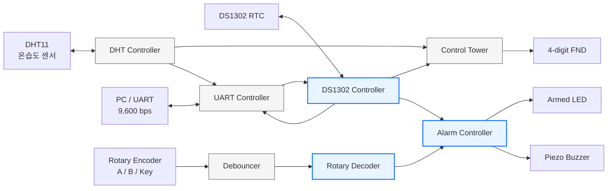
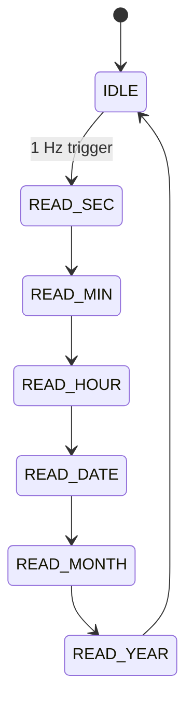
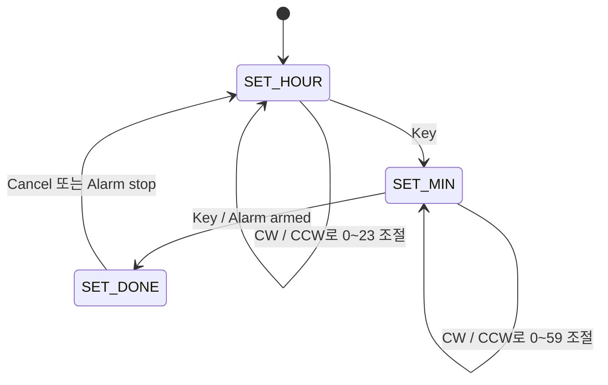

<div align="center">

# 🌬️ FPGA Air Handling Unit

### DS1302 RTC·DHT11·Rotary Encoder 기반 환경 모니터링 및 알람 시스템

Basys 3 FPGA에서 온습도와 현재 시각을 실시간으로 확인하고,<br>
로터리 엔코더로 알람을 설정해 LED와 부저로 알려주는 Verilog 기반 임베디드 시스템입니다.

</div>

---

## 📌 Project Overview

이 프로젝트는 **FPGA만으로 센서 수집, RTC 통신, 사용자 입력, 화면 출력, UART 통신, 알람 제어를 동시에 수행**하도록 설계한 Air Handling Unit 모니터링 프로토타입입니다.

100 MHz 시스템 클럭을 기준으로 각 기능을 독립적인 RTL 모듈로 나누었습니다. DHT11의 온습도와 DS1302의 날짜·시간을 주기적으로 읽고, 4-digit FND와 UART로 출력합니다. 사용자는 로터리 엔코더로 알람 시각을 설정할 수 있으며, 설정 시각이 되면 LED와 부저가 동작합니다.

| 항목 | 내용 |
| --- | --- |
| FPGA Board | Digilent Basys 3 |
| FPGA Device | Xilinx Artix-7 `XC7A35T-1CPG236C` |
| System Clock | 100 MHz |
| HDL / Tool | Verilog HDL / Vivado 2021.1 |
| Sensors | DHT11 온습도 센서, DS1302 RTC |
| User Input | Rotary Encoder, Push Button, Slide Switch |
| User Output | 4-digit 7-Segment FND, LED, Piezo Buzzer |
| Communication | DS1302 3-wire Serial, DHT11 1-wire, UART 9,600 bps |

> **MCU나 Soft Processor 없이, 센서 프로토콜과 사용자 인터페이스를 모두 순수 RTL 상태 머신과 카운터로 구현했습니다.**

---

## 📂 Contents

- [👨‍💻 My Contribution](#-my-contribution)
- [🧩 System Architecture](#-system-architecture)
- [✨ Key Features](#-key-features)
- [🕒 DS1302 RTC Controller](#-ds1302-rtc-controller)
- [🎛️ Rotary Encoder](#-rotary-encoder)
- [⏰ Alarm Controller](#-alarm-controller)
- [🔬 Oscilloscope Measurement](#-oscilloscope-measurement)
- [🖥️ Display & UART Interface](#-display--uart-interface)
- [🧪 Troubleshooting & Design Decisions](#-troubleshooting--design-decisions)
- [📊 Implementation Results](#-implementation-results)
- [🔌 Hardware Interface](#-hardware-interface)
- [🚀 Build & Run](#-build--run)
- [📁 Repository Guide](#-repository-guide)

---

## 👨‍💻 My Contribution

이 프로젝트에서 저는 **DS1302 RTC 통신, 로터리 엔코더 입력 처리, 알람 설정 및 출력 기능을 직접 설계·구현**했습니다. 또한 실제 보드의 디지털 신호를 **오실로스코프로 직접 측정하고 파형을 분석**해, 시뮬레이션뿐 아니라 하드웨어 레벨에서도 동작을 검증했습니다.

| 담당 영역 | 직접 구현한 내용 |
| --- | --- |
| **DS1302 RTC Controller** | 3-wire 통신 FSM, 명령·데이터 LSB-first 전송, 양방향 I/O 제어, 시각 읽기·쓰기, BCD 변환, Write Protect 제어 |
| **Rotary Encoder** | A/B상 전이 조합에 따른 CW·CCW 방향 판별, 유효 전이를 1-clock tick으로 변환, Push Key edge 검출 |
| **Alarm Setting** | `시 설정 → 분 설정 → 설정 완료` 상태 머신, 24시간·60분 범위 순환, 알람 활성화·취소·정지 처리 |
| **Alarm Output** | RTC 시각 비교, LED 상태 표시, 약 261.6 Hz 부저 음 생성, 500 ms ON/OFF 비프 패턴 구현 |
| **Hardware Verification** | DS1302의 `CE`·`SCLK`·`I/O` 및 로터리 A/B상 파형 실측, 주기·위상·비트 순서 분석 |

### 구현에서 중점적으로 해결한 부분

- DS1302의 단일 양방향 데이터 핀을 읽기·쓰기 시점에 맞춰 안전하게 전환
- 레지스터 주소와 데이터를 DS1302 규격에 맞게 **LSB-first**로 전송
- RTC의 BCD 데이터와 시스템 내부의 일반 정수 데이터를 구분해 변환
- 로터리 엔코더의 접점 노이즈와 잘못된 방향 판정을 줄이기 위한 디바운싱·상태 전이 판별
- 알람 설정 중 입력 처리와 실제 시각 비교, 부저 파형 생성을 서로 독립적인 순차 회로로 구성

---

## 🧩 System Architecture



- 파란색: 직접 설계·구현한 핵심 모듈
- 회색: 전체 시스템을 구성하는 연동 모듈

### 전체 데이터 흐름

```text
DS1302 현재 시각 ─┬─→ FND 시각 표시
                  ├─→ UART 주기 전송
                  └─→ 설정 알람과 비교 ─→ LED / Buzzer

DHT11 온습도  ────┬─→ FND 온습도 표시
                  └─→ UART 주기 전송

Rotary A/B/Key ─→ 방향·클릭 tick ─→ 알람 시·분 설정
PC UART 명령   ─→ 날짜·시간 파싱 ─→ DS1302 시간 갱신
```

---

## ✨ Key Features

### 1. 실시간 환경 정보와 시각 표시

- DHT11을 1초마다 구동해 온도와 습도 수집
- DS1302의 초·분·시·일·월·년 레지스터를 1초마다 읽음
- 왼쪽 버튼으로 `온도·습도 ↔ 현재 시각` 화면 전환
- 알람 설정 중에는 설정 시각을 FND에 즉시 반영

### 2. UART 기반 모니터링과 RTC 설정

- 현재 날짜·시간과 온습도를 9,600 bps UART로 주기 전송
- PC에서 `setrtc` 명령을 전송해 RTC 날짜·시간 설정
- 수신 명령을 개행 단위 Circular Queue에 저장하여 처리
- RTC가 사용 중일 때 쓰기 요청이 충돌하지 않도록 `busy` handshake 적용

### 3. 로터리 기반 알람 UI

- 회전 방향에 따라 시·분 증가 또는 감소
- 시는 `00~23`, 분은 `00~59` 범위에서 순환
- 로터리 Key로 `시 → 분 → 설정 완료` 단계 이동
- 알람 활성화 상태를 LED로 표시하고, 설정 시각 도달 시 부저 동작
- 알람이 울리는 동안 Key를 누르면 즉시 정지

---

## 🕒 DS1302 RTC Controller

📂 [`AHU.srcs/sources_1/new/ds1302_controller.v`](AHU.srcs/sources_1/new/ds1302_controller.v)

DS1302 제어부는 레지스터 단위 동작을 관리하는 상위 FSM과 실제 비트 송수신을 수행하는 하위 FSM으로 분리했습니다.

### 계층 구조

| 모듈 | 역할 |
| --- | --- |
| `ds1302_controller` | 초·분·시·일·월·년의 연속 읽기/쓰기 순서, BCD 변환, Write Protect 제어 |
| `ds1302_logic` | `CE`, `SCLK`, `I/O` 타이밍 생성, 8-bit Command/Data shift |
| `ds1302` | 양방향 데이터 핀의 입력·출력·High-Z 전환 |

### 읽기 동작



| Register | Read Command | Mask | 출력 처리 |
| --- | ---: | ---: | --- |
| Seconds | `0x81` | `0x7F` | CH bit 제거 후 BCD → Decimal |
| Minutes | `0x83` | `0x7F` | BCD → Decimal |
| Hours | `0x85` | `0x3F` | 24-hour 영역 추출 후 변환 |
| Date | `0x87` | `0x3F` | BCD → Decimal |
| Month | `0x89` | `0x1F` | BCD → Decimal |
| Year | `0x8D` | - | BCD → Decimal |

### 시간 쓰기 동작

DS1302는 Write Protect가 켜진 상태에서 시간 레지스터를 수정할 수 없습니다. 따라서 쓰기 요청은 다음 순서로 처리합니다.

```text
Write Request
  → WP OFF  (`0x8E ← 0x00`)
  → SEC     (`0x80`)
  → MIN     (`0x82`)
  → HOUR    (`0x84`)
  → DATE    (`0x86`)
  → MONTH   (`0x88`)
  → YEAR    (`0x8C`)
  → WP ON   (`0x8E ← 0x80`)
  → set_time_done pulse
```

초 레지스터를 쓸 때는 `i_sec & 8'h7F`를 적용해 Clock Halt bit가 실수로 설정되지 않도록 했습니다.

### 양방향 I/O 처리

```verilog
assign ds1302_data = io_mode ? 1'bz : o_data;
assign i_data      = ds1302_data;
```

- Command 전송 구간: FPGA가 데이터 선을 구동
- Read Data 구간: FPGA 출력을 High-Z로 바꾸고 DS1302가 선을 구동
- Write Data 구간: FPGA가 계속 데이터 선을 구동

이 구조로 하나의 `I/O` 핀에서 발생할 수 있는 bus contention을 방지했습니다.

---

## 🎛️ Rotary Encoder

📂 [`AHU.srcs/sources_1/new/rotary.v`](AHU.srcs/sources_1/new/rotary.v)

로터리 엔코더의 A/B상은 회전 방향에 따라 서로 다른 Gray-code 순서를 만듭니다. 이전 상태와 현재 상태를 조합한 4-bit 값을 비교하여 유효한 방향만 1-clock pulse로 변환했습니다.

| 방향 | 검출한 상태 전이 |
| --- | --- |
| CW | `11→01`, `01→00`, `00→10`, `10→11` |
| CCW | `11→10`, `10→00`, `00→01`, `01→11` |

```text
A/B 상태 샘플링
      ↓
{previous, current} 비교
      ├─ CW 유효 전이  → cw_tick  = 1 clock
      ├─ CCW 유효 전이 → ccw_tick = 1 clock
      └─ 그 외 전이     → 무시
```

Push Key도 이전 값과 현재 값을 비교해 상승 edge에서만 `key_tick`을 한 클럭 동안 발생시킵니다. 입력 신호는 방향 판별 전에 10 ms 동안 안정된 값만 통과시키는 디바운서를 거칩니다.

---

## ⏰ Alarm Controller

📂 [`AHU.srcs/sources_1/new/alarm_controller.v`](AHU.srcs/sources_1/new/alarm_controller.v)

### 알람 설정 상태 머신



| 상태 | 사용자 동작 | 시스템 동작 |
| --- | --- | --- |
| `SET_HOUR` | 로터리 회전 | 알람 시를 0~23 범위에서 순환 |
| `SET_HOUR` | Key 클릭 | 분 설정 단계로 이동 |
| `SET_MIN` | 로터리 회전 | 알람 분을 0~59 범위에서 순환 |
| `SET_MIN` | Key 클릭 | 알람 활성화, LED ON |
| Armed | 설정 Switch ON + Key | 예약 취소, LED OFF |
| Ringing | Key 클릭 | 부저 정지 및 설정 상태 초기화 |

RTC의 `hour`, `minute`, `second`를 비교하고 초가 `00`일 때 알람을 한 번만 시작합니다. 시작과 동시에 armed flag를 해제해 같은 1분 동안 반복적으로 재트리거되는 것을 방지했습니다.

### 부저 파형 생성

100 MHz 시스템 클럭을 카운터로 분주해 약 261.6 Hz의 도(C4) 음을 만들고, 별도 카운터로 500 ms마다 음을 켜고 끕니다.

```text
Tone Counter    : 191,112 clocks마다 buzzer toggle
Toggle Interval : 191,112 / 100 MHz = 1.91112 ms
Tone Frequency  : 100 MHz / (2 × 191,112) ≈ 261.63 Hz
Beep Pattern    : 500 ms ON ↔ 500 ms OFF
```

톤 생성과 알람 상태 제어를 서로 다른 sequential block으로 분리해, 알람 설정 로직과 고속 출력 토글 로직이 섞이지 않도록 구성했습니다.

---

## 🔬 Oscilloscope Measurement

시뮬레이션 결과에만 의존하지 않고, 실제 Basys 3와 주변 장치를 연결한 뒤 오실로스코프로 통신 파형을 직접 측정하고 분석했습니다.

### DS1302 실측 포인트

```text
CE    ____/‾‾‾‾‾‾‾‾‾‾‾‾‾‾‾‾\____
SCLK  _____/‾\_/‾\_/‾\_/‾\_/‾\_____
I/O   ----- C0 C1 C2 ... C7 D0 ... D7 -----
             └─ Command ─┘ └── Data ──┘
                 LSB first
```

| 분석 항목 | 실측·확인 내용 |
| --- | --- |
| `CE` | Transaction 시작 전에 High, 8-bit Command와 8-bit Data 종료 후 Low |
| `SCLK` | 100 MHz 기준 50-clock마다 toggle되어 약 1 μs 주기, 약 1 MHz로 동작 |
| Bit Order | Command의 bit 0부터 순차적으로 출력되는 LSB-first 전송 확인 |
| I/O Direction | Read Command 이후 FPGA 출력이 High-Z로 전환되고 RTC 응답이 입력되는 구간 확인 |
| Data Decode | 측정 파형의 bit 값을 레지스터 명령·BCD 데이터와 대조해 FND/UART 결과 확인 |

### Rotary Encoder 실측 포인트

```text
CW 회전
A  ____/‾‾‾‾\________/‾‾‾‾\____
B  ______/‾‾‾‾\________/‾‾‾‾\__
        A와 B의 위상 선행 관계로 방향 판별

CCW 회전
A  ______/‾‾‾‾\________/‾‾‾‾\__
B  ____/‾‾‾‾\________/‾‾‾‾\____
        반대 위상 순서가 입력됨
```

- 회전 방향에 따라 A/B상의 선행 신호가 바뀌는 것을 확인
- 기계 접점에서 짧은 bounce가 발생하는 구간을 관찰하고 디바운싱 필요성 확인
- 디바운싱 후의 안정된 상태 전이와 `cw_tick`·`ccw_tick` 발생 결과를 비교

> 실제 파형의 주기와 비트 순서를 RTL의 counter 값 및 state transition과 대조하면서, 통신 오류가 배선 문제인지 타이밍·방향 전환 문제인지 구분해 디버깅했습니다.

---

## 🖥️ Display & UART Interface

### FND 화면

왼쪽 버튼을 누를 때마다 화면이 전환되며, 4-digit FND는 `XX.XX` 형식을 사용합니다.

| Mode | Switch | 표시 예시 | 의미 |
| --- | --- | --- | --- |
| 온습도 | 관계없음 | `25.48` | 온도 25 °C / 습도 48 % |
| 시계 | Alarm Switch OFF | `14.30` | 현재 시각 14:30 |
| 시계 | Alarm Switch ON | `07.45` | 설정 중인 알람 07:45 |

### UART 송신 형식

1초 주기로 날짜·시간과 온습도를 ASCII 문자열로 전송합니다.

```text
2026.03.09.17.00.00
T:25.00
H:48.00
```

### UART RTC 설정 명령

```text
setrtcYYMMDDhhmmss<CR><LF>
```

예를 들어 `2026-03-09 17:00:00`으로 설정하려면 다음 문자열을 전송합니다.

```text
setrtc260309170000
```

수신부는 ASCII 숫자를 4-bit 단위로 변환해 `YY/MM/DD/hh/mm/ss` 순서의 48-bit BCD 데이터로 만들고, DS1302가 유휴 상태일 때 쓰기 transaction을 시작합니다.

---

## 🧪 Troubleshooting & Design Decisions

| 문제 | 원인 | 해결 |
| --- | --- | --- |
| DS1302 읽기 구간에서 데이터 충돌 | Command 전송 후에도 FPGA가 I/O 선을 계속 구동 | `io_mode`에 따라 출력 또는 `High-Z`로 전환하는 tri-state 구조 적용 |
| RTC 값이 실제 시각과 다르게 해석됨 | DS1302 레지스터는 일반 Binary가 아닌 BCD 사용 | Read 시 `from_bcd()` 변환, UART 설정 값은 BCD nibble로 패킹 |
| DS1302 시간이 갱신되지 않음 | Write Protect bit가 설정된 상태 | `WP OFF → 시간 쓰기 → WP ON` 순서를 별도 FSM으로 구현 |
| 로터리 방향이 반대로 판정되거나 여러 번 입력됨 | A/B상 순서 및 기계식 접점 bounce | 10 ms 디바운싱 후 Gray-code 유효 전이만 방향 tick으로 변환 |
| 알람이 같은 시각에 반복 시작될 가능성 | 초가 00인 동안 비교 조건이 여러 클럭 연속 참 | 최초 일치 시 armed flag를 즉시 해제하여 1회만 trigger |
| 부저 음과 비프 간격을 함께 만들기 어려움 | 음높이와 ON/OFF 패턴의 시간 단위가 다름 | Tone counter와 500 ms pattern counter를 분리 |
| RTC 읽기와 UART 시간 쓰기 충돌 | 두 요청이 같은 3-wire bus를 공유 | `busy`, `write_request`, `set_time_done` handshake로 transaction 순서 보장 |

---

## 📊 Implementation Results

Vivado 구현 결과, 100 MHz 시스템 클럭의 timing constraint를 만족했고 bitstream 생성까지 완료했습니다.

| 항목 | 결과 |
| --- | ---: |
| Worst Negative Slack (WNS) | **1.161 ns** |
| Total Negative Slack (TNS) | **0.000 ns** |
| Worst Hold Slack (WHS) | **0.153 ns** |
| Timing Violations | **0** |
| Slice LUT | 1,581 / 20,800 (**7.60%**) |
| Slice Register | 2,145 / 41,600 (**5.16%**) |
| Bonded I/O | 27 / 106 (**25.47%**) |
| BUFG | 1 / 32 (**3.13%**) |

관련 결과 파일:

- [`top_timing_summary_routed.rpt`](AHU.runs/impl_1/top_timing_summary_routed.rpt)
- [`top_utilization_placed.rpt`](AHU.runs/impl_1/top_utilization_placed.rpt)
- [`top.bit`](AHU.runs/impl_1/top.bit)

---

## 🔌 Hardware Interface

| 기능 | Top Port | FPGA Pin | Board Interface |
| --- | --- | --- | --- |
| System Clock | `clk` | W5 | 100 MHz Oscillator |
| Reset | `reset` | R2 | SW15 |
| Alarm Mode | `sw` | V17 | SW0 |
| Display Mode | `btnL` | W19 | BTNL |
| Alarm LED | `led` | U16 | LED0 |
| Buzzer | `buzzer` | G2 | JA4 |
| DS1302 SCLK | `ds1302_sclk` | A14 | JB1 |
| DS1302 I/O | `ds1302_data` | A16 | JB2 |
| DS1302 CE | `ds1302_ce` | B15 | JB3 |
| Rotary A | `s1` | K17 | JC1 |
| Rotary B | `s2` | M18 | JC2 |
| Rotary Key | `key` | N17 | JC3 |
| DHT11 Data | `dht11_data` | J3 | JXADC XA1_P |
| UART RX | `RsRx` | B18 | USB-UART |
| UART TX | `RsTx` | A18 | USB-UART |

> DHT11과 DS1302의 데이터 핀은 양방향 신호입니다. 모듈 전원과 GND를 먼저 확인하고, 사용 중인 센서 보드에 필요한 pull-up 저항이 구성되어 있는지 확인해야 합니다.

---

## 🚀 Build & Run

### 1. Vivado 프로젝트 열기

Vivado 2021.1 이상에서 루트 디렉터리의 프로젝트 파일을 엽니다.

```text
AHU.xpr
```

### 2. Top 및 Constraint 확인

- Top module: `top`
- Device: `xc7a35tcpg236-1`
- Constraint: `AHU.srcs/constrs_1/imports/new/basys3.xdc`
- System clock constraint: 100 MHz / 10 ns

### 3. Bitstream 생성

```text
Run Synthesis
  → Run Implementation
  → Generate Bitstream
  → Open Hardware Manager
  → Program Device
```

이미 생성된 bitstream은 다음 위치에 있습니다.

```text
AHU.runs/impl_1/top.bit
```

### 4. 기본 사용 순서

1. Basys 3와 DS1302, DHT11, 로터리 엔코더, 부저를 연결합니다.
2. Bitstream을 FPGA에 program하고 Reset을 해제합니다.
3. `BTNL`로 온습도 화면과 시계 화면을 전환합니다.
4. 알람 설정 시 `SW0`을 올리고 로터리로 시를 선택한 뒤 Key를 누릅니다.
5. 로터리로 분을 선택하고 Key를 다시 눌러 알람을 활성화합니다.
6. LED가 켜지면 알람이 정상적으로 armed된 상태입니다.
7. 설정 시각에 부저가 울리면 로터리 Key로 정지합니다.

---

## 📁 Repository Guide

```text
Air-Handling-Unit-master/
├── AHU.xpr
├── AHU.srcs/
│   ├── sources_1/
│   │   ├── new/
│   │   │   ├── top.v                  # 전체 모듈 연결
│   │   │   ├── ds1302_controller.v    # 직접 구현: RTC 3-wire 통신
│   │   │   ├── rotary.v               # 직접 구현: 로터리 방향·Key 검출
│   │   │   ├── alarm_controller.v     # 직접 구현: 알람 설정·비교·부저
│   │   │   ├── dht_controller.v       # DHT11 온습도 수집
│   │   │   ├── control_tower.v        # FND 표시 데이터 선택
│   │   │   ├── data_sender.v          # UART 출력 문자열 생성
│   │   │   └── data_receiver.v        # UART setrtc 명령 처리
│   │   └── imports/new/
│   │       ├── btn_debouncer.v
│   │       ├── fnd_controller.v
│   │       ├── tick_gen.v
│   │       ├── uart_controller.v
│   │       ├── uart_rx.v
│   │       └── uart_tx.v
│   ├── constrs_1/imports/new/
│   │   └── basys3.xdc                 # Basys 3 pin / clock constraint
│   └── sim_1/new/
│       ├── tb_ds1302.v
│       └── tb_data_receiver.v
└── AHU.runs/
    ├── synth_1/                        # Synthesis 결과
    └── impl_1/
        ├── top.bit                     # FPGA programming bitstream
        ├── top_timing_summary_routed.rpt
        └── top_utilization_placed.rpt
```

---

<div align="center">

**센서 데이터를 읽는 것에서 끝나지 않고, 프로토콜의 실제 파형을 측정하고 분석하며 하드웨어 동작까지 검증한 FPGA 프로젝트입니다.**

</div>
